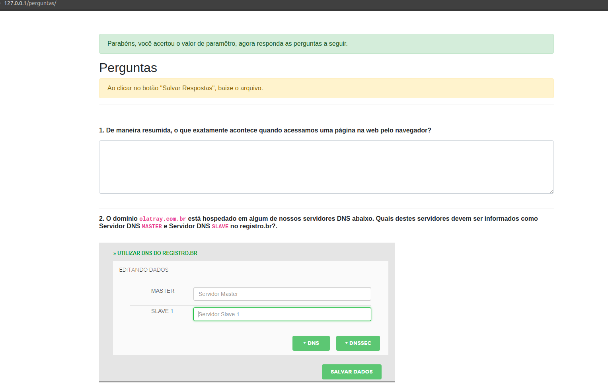

Criar um servidor Web Linux com PHP no Ubuntu Server 18 e rodar o código no link https://github.com/luishscosta/teste-devops, que deve ter o seguinte resultado:

# Requisitos

- Criar Usuário Própio no Linux
  - Usuário root não deve conseguir logar diretamente
- Acesso via terminal remoto (Shell)
- Servidor Web PHP
- Código PHP instalado
- Acessar a URL http://**seudominioouip**/perguntas deve abrir a página acima

## Resultados esperado

- Script com automação do servidor na linguagem/ferramenta de sua preferência
  - Este script será executado em uma máquina Ubuntu Server 18 e a unica interação humana será o comando `./setup`
  - A automação também deve fazer a aplicação rodar sem Bugs.
- Arquivos de resposta gerado pela aplicação de perguntas 
- Documentação simples
    - Lista de comando executados
    - Software e versões instaladas 
- Enviar todos itens acima para um repositório do GitHub e nos responder o e-mail da prova com o Link
